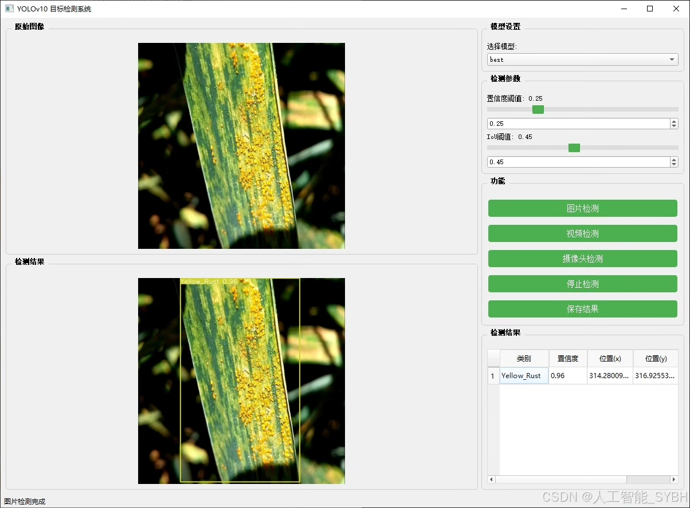
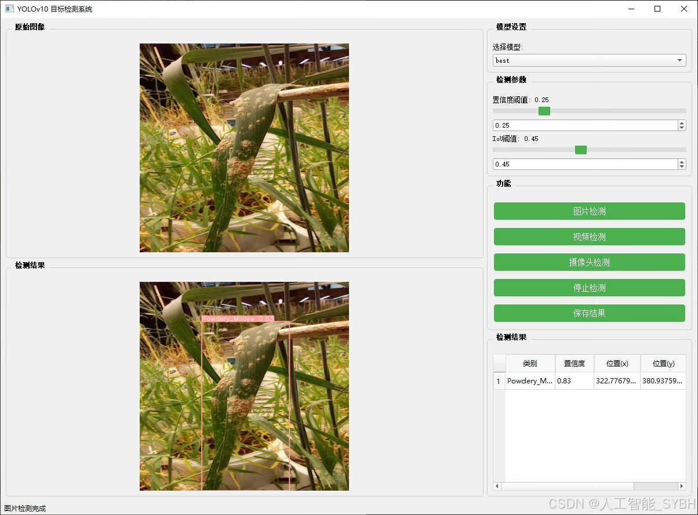
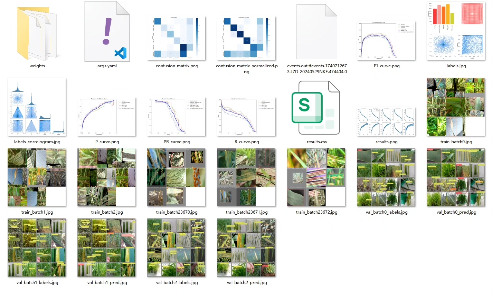
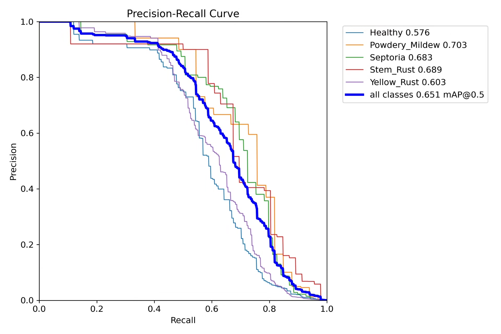
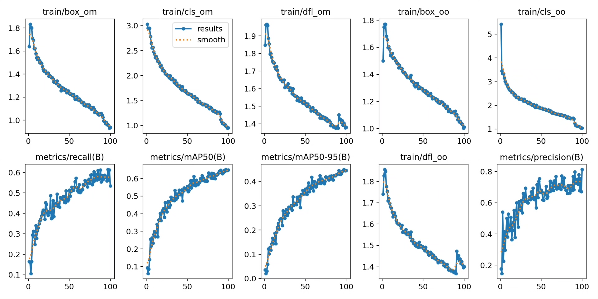
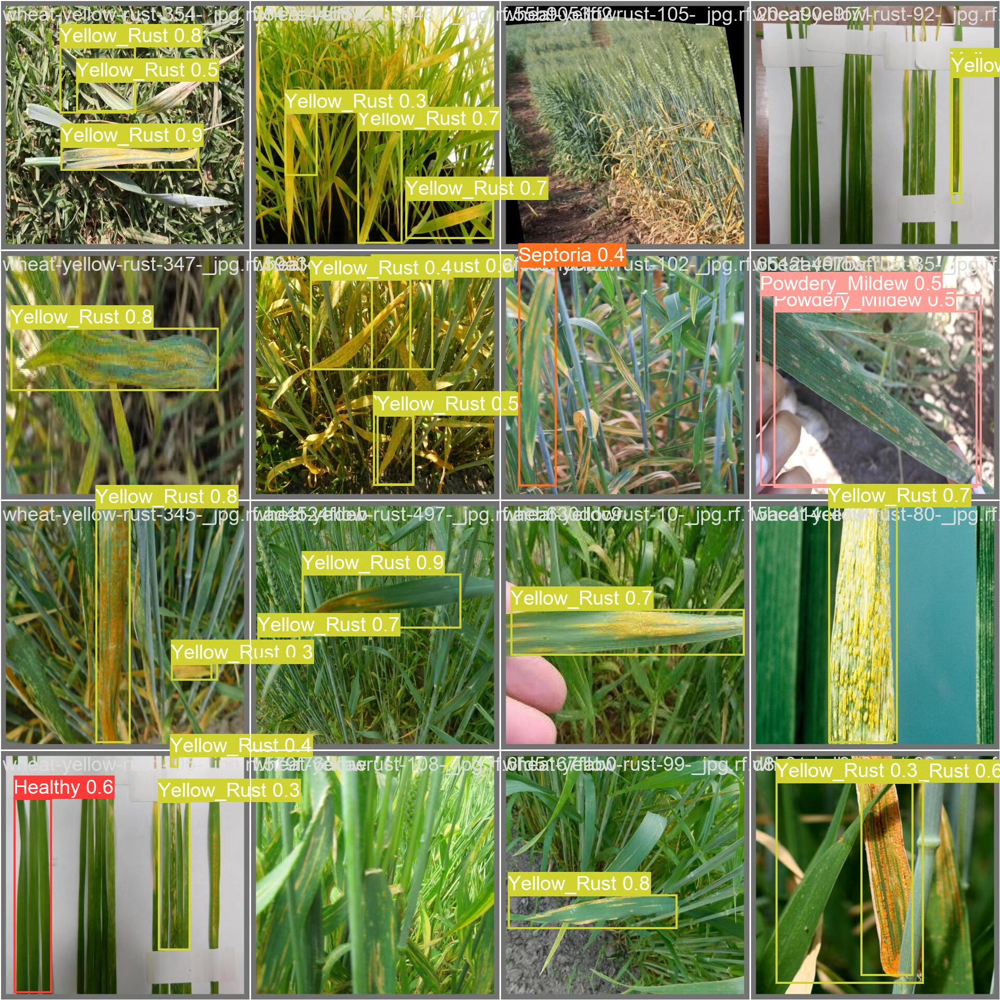
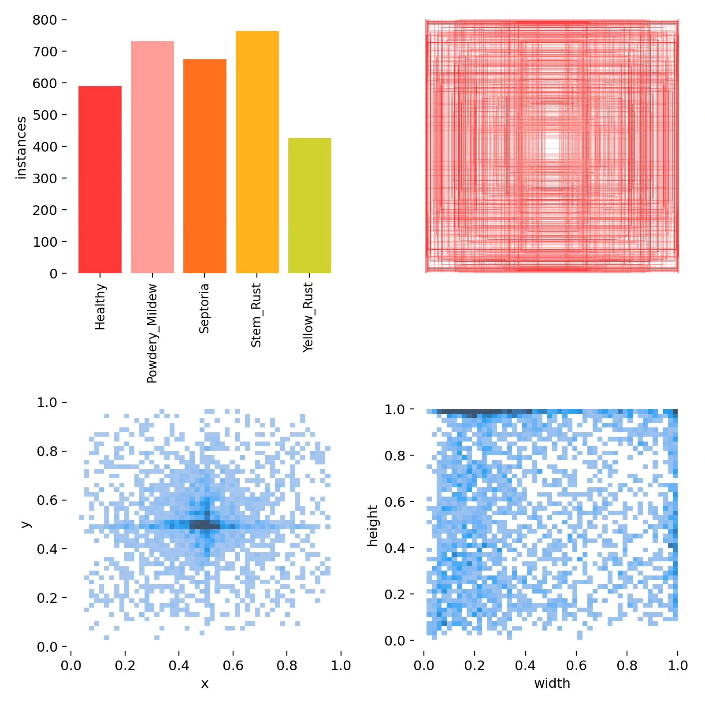
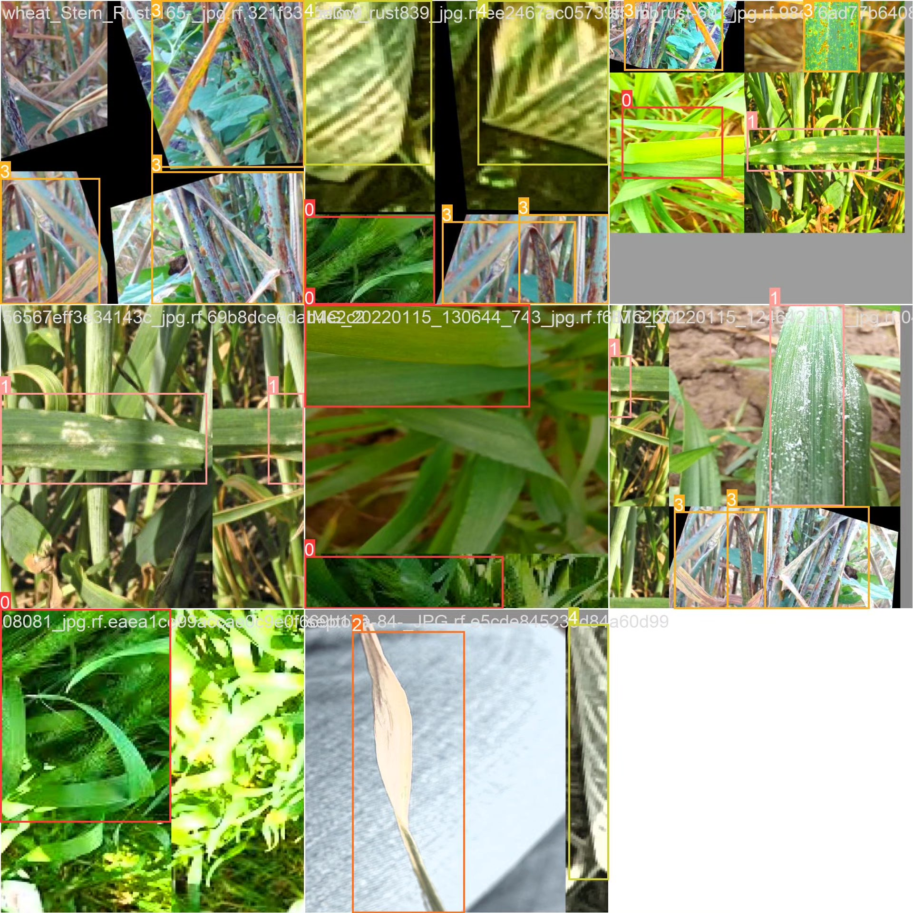

# Based on deep learning YOLOv10 for wheat leaf disease detection system (YOLOv

## Body

Based on the deep learning YOLOv10, a wheat leaf disease detection system (YOLOv10+YOLO dataset + UI interface + Python project source code + model) has been developed. This project utilizes the YOLOv10 (You Only Look Once version 10) object detection algorithm to develop an efficient wheat leaf disease detection system. The system can automatically detect diseased areas in wheat leaf images and classify the types of diseases (such as healthy leaves, powdery mildew, leaf blight, rust, yellow rust), providing planting households with disease early warning and prevention and treatment suggestions.

The company's products have obtained the official commercial license certification from YOLO.

We provide after-sales service.

After payment, we will provide WeChat ID for any questions.

Environment configuration: We will provide a tutorial on environment configuration, and WeChat will provide answers.

Remote installation service: If you need remote configuration, an additional fee of 69 is required,

If the configuration fails, all fees will be refunded (specially for old computers only refund installation fees).

Retraining dataset: After configuring the environment, you can train on your own computer.
If you need us to retrain, just pay 69 plus computing power fees (2.5 yuan/hour).

Full after-sales service

## Images

## Payment

Here is a pay link on Stripe ( https://buy.stripe.com/3cs8yP7sY87d0vu9AB ). Please contact me lonlonago@foxmail.com after funding $89, and I will send you a complete data files , thank you!

